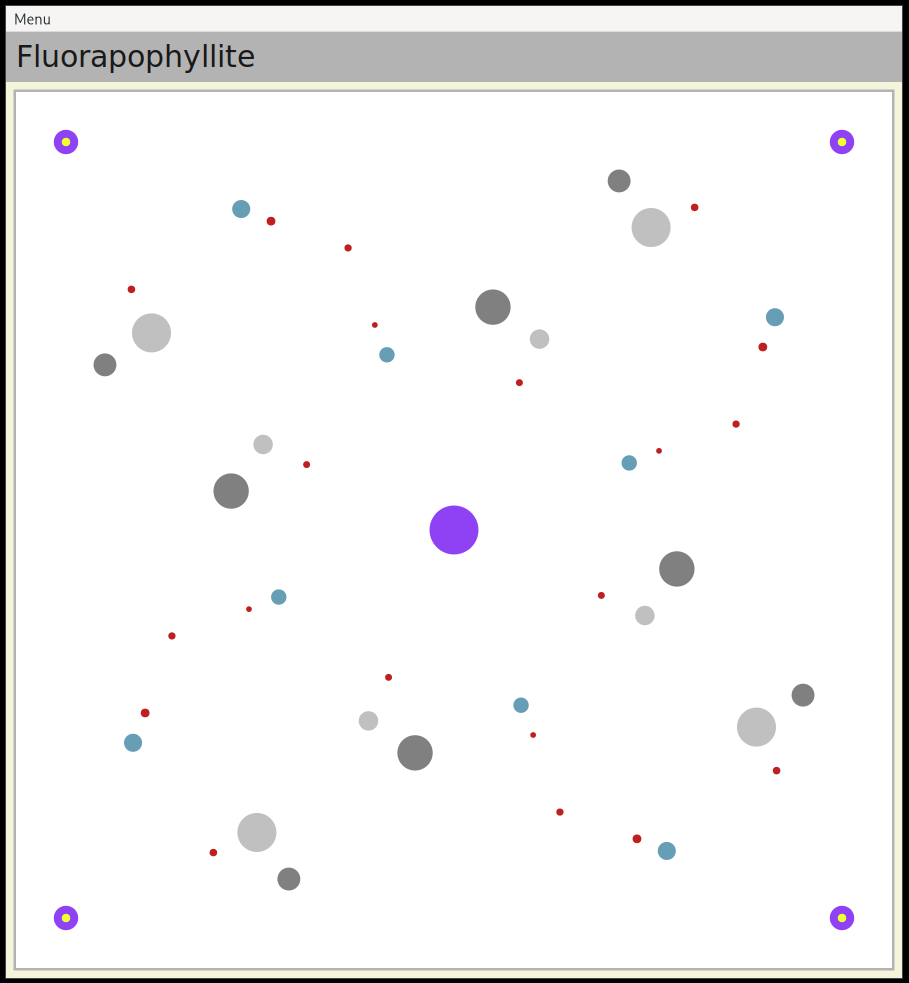

# bfcv - Basic Fortran CIF Viewer
<p align="justify">A basic program capable of reading CIF files and visualizing the crystallographic information they contain.</p>

<p align="justify">The program is designed to read CIF (Crystallographic Information File) format files. These files contain information about the atomic positions and unit cell parameters of crystal structures. The program can extract this information and display the crystal structure in a simplified 3D format from a single perspective, allowing the user to view the arrangement of atoms within the crystal. In addition to visualizing the crystal structure, the program can provide statistics about the structure, such as the total molecular mass of the crystal. It can also estimate the ionic binding energy of the crystal, which is a measure of the strength of the interactions between positively and negatively charged atoms in the crystal. The program can also identify potential bonds between atoms in the crystal structure. This can be useful in understanding the chemical bonding within the crystal, as well as predicting the reactivity of the crystal with other substances.</p>



## Requirements
<p align="justify">To compile this program a fortran compiler capable of fortran90 (gfortran) is needed, as well as the installation of [gtk-fortran](https://github.com/vmagnin/gtk-fortran). To run this program you need the gtk4 library.</p>

## Compilation
<p align="justify">To compile this program please make sure that all the requirements are installed and that your PKG_CONFIG_PATH points to the correct directories as explained in the guide of gtk-fortran. Once this is done simply run make:</p>

```
make
```
